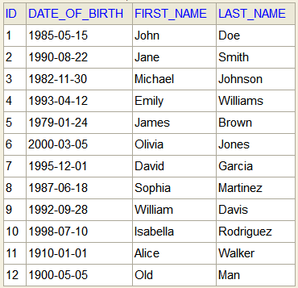

# Problem Statement: 
- Create a spring boot application.
- Expose a HTTP method to post Customer details - First Name, Last Name and Date Of Birth
- Use In memory database to persist the customer details.
- Create another HTTP method to retrieve the customer details.

## Cases covered: 
- Data persisted in memory using H2 DB. 
- Validations
  - DOB should be lesser than today.
  - Fist name cannot be empty.
  - First and Last Name cannot have special characters.
- Added support for getting list of all customers currently in DB.
- Added support for getting list of all customers based on first, last or both names.
- In case of multiple hits, data for all matching customers will be returned.

## Collection for endpoints added in resources folder   
- file name: Allica.postman_collection.json

## H2 Console details:

- Link: http://localhost:8080/h2-console  
- Username: test  
- Password: password  
- JDBC URL: jdbc:h2:mem:testdb

## Sample Data added upon startup:

